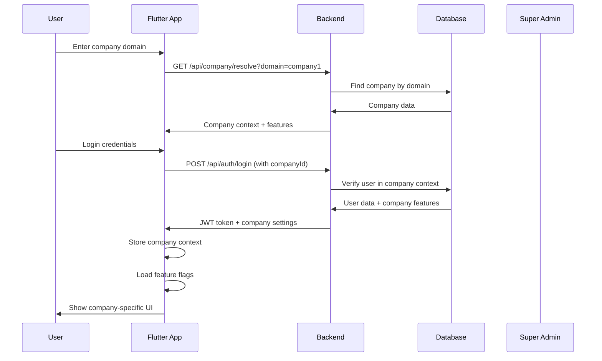
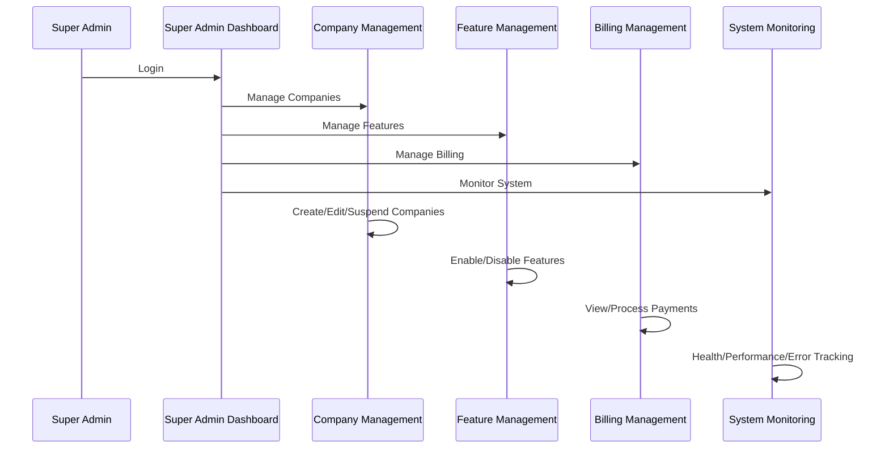
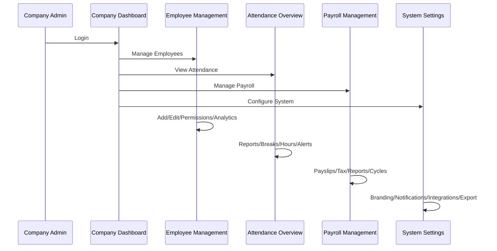
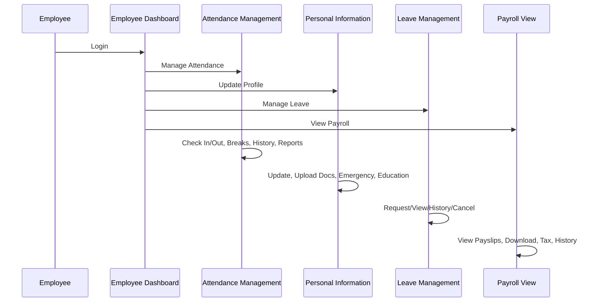
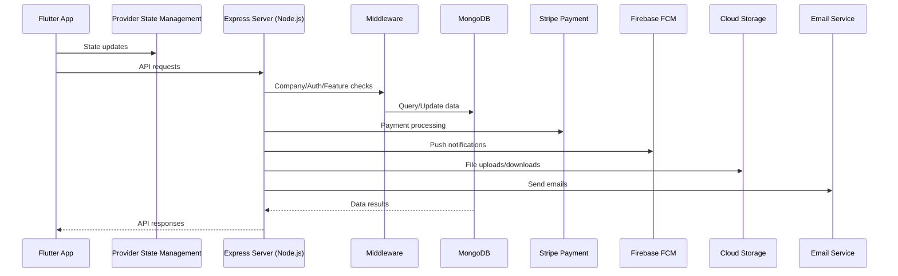
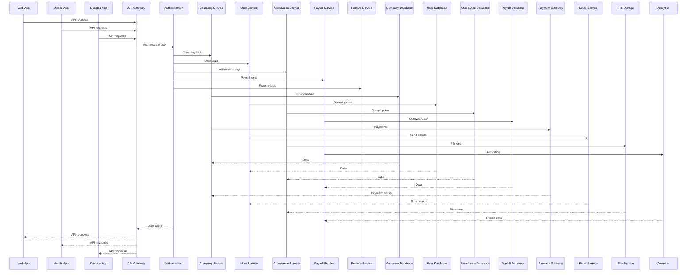
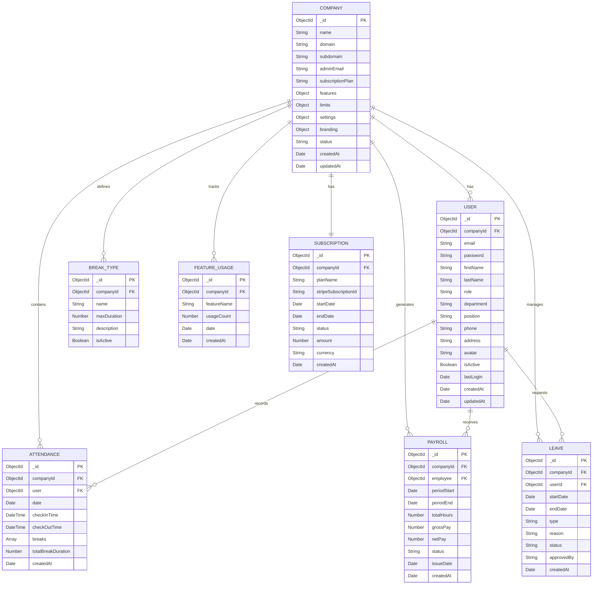

# Multi-Tenant SNS Rooster Implementation Guide

## Table of Contents
1. [Complications Analysis & Solutions](#1-complications-analysis--solutions)
2. [Complete App Flow Analysis](#2-complete-app-flow-analysis)
3. [Database Architecture](#3-database-architecture)
4. [Implementation Roadmap](#4-implementation-roadmap)
5. [Technical Challenges & Solutions](#5-technical-challenges--solutions)

---

## 1. COMPLICATIONS ANALYSIS & SOLUTIONS

### **1.1 Data Isolation & Security**

#### **Complications:**
- **Cross-company data leakage**: Users from Company A accessing Company B's data
- **Database query complexity**: Ensuring all queries filter by company
- **File storage isolation**: Preventing file access across companies
- **API security**: Ensuring endpoints respect company boundaries

#### **Solutions:**

```javascript
// 1. Database-level isolation
const companyFilterMiddleware = (req, res, next) => {
  if (!req.companyId) {
    return res.status(403).json({ error: 'Company context required' });
  }
  
  // Add company filter to all queries
  req.query.companyId = req.companyId;
  req.body.companyId = req.companyId;
  next();
};

// 2. Model-level company association
const baseSchema = {
  companyId: {
    type: mongoose.Schema.Types.ObjectId,
    ref: 'Company',
    required: true,
    index: true
  }
};

// 3. File storage isolation
const getCompanyFilePath = (companyId, fileName) => {
  return `uploads/companies/${companyId}/${fileName}`;
};

// 4. API route protection
const requireCompanyContext = (req, res, next) => {
  const companyId = req.headers['x-company-id'] || req.query.companyId;
  if (!companyId) {
    return res.status(403).json({ error: 'Company context required' });
  }
  req.companyId = companyId;
  next();
};
```

### **1.2 Performance & Scalability**

#### **Complications:**
- **Database performance**: Large datasets across multiple companies
- **Memory usage**: Caching strategies for multi-tenant data
- **Query optimization**: Efficient filtering by company
- **Resource allocation**: Fair distribution across companies

#### **Solutions:**

```javascript
// 1. Database indexing strategy
const createCompanyIndexes = () => {
  // Compound indexes for company-specific queries
  db.collection('users').createIndex({ companyId: 1, email: 1 });
  db.collection('attendance').createIndex({ companyId: 1, date: 1 });
  db.collection('payroll').createIndex({ companyId: 1, periodStart: 1 });
};

// 2. Caching with company context
const companyCache = new Map();
const getCompanyCacheKey = (companyId, key) => `${companyId}:${key}`;

// 3. Query optimization
const optimizeCompanyQuery = (query, companyId) => {
  return query.where('companyId', companyId).lean();
};

// 4. Resource monitoring
const monitorCompanyUsage = (companyId) => {
  return {
    databaseQueries: getQueryCount(companyId),
    storageUsed: getStorageUsage(companyId),
    apiCalls: getApiCallCount(companyId)
  };
};
```

### **1.3 Feature Management & Customization**

#### **Complications:**
- **Feature complexity**: Different companies need different features
- **UI customization**: Branding and theme per company
- **Workflow variations**: Different approval processes
- **Integration requirements**: Third-party integrations per company

#### **Solutions:**

```javascript
// 1. Feature flag system
const FeatureFlags = {
  ATTENDANCE: 'attendance',
  PAYROLL: 'payroll',
  LEAVE_MANAGEMENT: 'leave_management',
  ANALYTICS: 'analytics',
  DOCUMENT_MANAGEMENT: 'document_management',
  NOTIFICATIONS: 'notifications',
  CUSTOM_BRANDING: 'custom_branding',
  API_ACCESS: 'api_access',
  MULTI_LOCATION: 'multi_location',
  ADVANCED_REPORTING: 'advanced_reporting'
};

// 2. Company-specific settings
const CompanySettings = {
  branding: {
    logo: String,
    primaryColor: String,
    secondaryColor: String,
    companyName: String
  },
  workflow: {
    leaveApprovalRequired: Boolean,
    attendanceGracePeriod: Number,
    overtimeThreshold: Number
  },
  integrations: {
    slack: { enabled: Boolean, webhook: String },
    email: { provider: String, apiKey: String },
    calendar: { type: String, credentials: Object }
  }
};
```

### **1.4 Billing & Subscription Management**

#### **Complications:**
- **Usage tracking**: Accurate measurement of resource usage
- **Billing cycles**: Different billing periods per company
- **Plan upgrades/downgrades**: Handling feature changes
- **Payment processing**: Multiple payment methods and currencies

#### **Solutions:**

```javascript
// 1. Usage tracking
const UsageTracker = {
  trackApiCall: (companyId, endpoint) => {
    // Increment API call counter
  },
  trackStorage: (companyId, bytes) => {
    // Update storage usage
  },
  trackEmployeeCount: (companyId, count) => {
    // Update employee count
  }
};

// 2. Subscription management
const SubscriptionManager = {
  async upgradePlan(companyId, newPlan) {
    // Handle plan upgrade logic
  },
  async downgradePlan(companyId, newPlan) {
    // Handle plan downgrade logic
  },
  async processPayment(companyId, amount) {
    // Process payment via Stripe/PayPal
  }
};
```

---

## 2. COMPLETE APP FLOW ANALYSIS

### **2.1 Multi-Tenant Authentication Flow**



### **2.2 Super Admin Management Flow**



---

## 2.3 Company Admin Workflow



---

## 2.4 Employee Workflow



---

## 2.5 Multi-Tenant System Architecture



---

## 2.6 Data Flow Architecture



---

## 3. DATABASE ARCHITECTURE

### **3.1 Company Model**

```javascript
// rooster-backend/models/Company.js
const companySchema = new mongoose.Schema({
  // Basic Information
  name: { type: String, required: true },
  domain: { type: String, unique: true, required: true },
  subdomain: { type: String, unique: true, required: true },
  
  // Contact Information
  adminEmail: { type: String, required: true },
  contactPhone: String,
  address: {
    street: String,
    city: String,
    state: String,
    postalCode: String,
    country: String
  },
  
  // Subscription & Billing
  subscriptionPlan: {
    type: String,
    enum: ['basic', 'professional', 'enterprise'],
    default: 'basic'
  },
  subscriptionId: String, // Stripe subscription ID
  billingCycle: {
    type: String,
    enum: ['monthly', 'yearly'],
    default: 'monthly'
  },
  nextBillingDate: Date,
  trialEndDate: Date,
  
  // Feature Configuration
  features: {
    attendance: { type: Boolean, default: true },
    payroll: { type: Boolean, default: true },
    leaveManagement: { type: Boolean, default: true },
    analytics: { type: Boolean, default: false },
    documentManagement: { type: Boolean, default: true },
    notifications: { type: Boolean, default: true },
    customBranding: { type: Boolean, default: false },
    apiAccess: { type: Boolean, default: false },
    multiLocation: { type: Boolean, default: false },
    advancedReporting: { type: Boolean, default: false },
    timeTracking: { type: Boolean, default: true },
    expenseManagement: { type: Boolean, default: false },
    performanceReviews: { type: Boolean, default: false },
    trainingManagement: { type: Boolean, default: false }
  },
  
  // Usage Limits
  limits: {
    maxEmployees: { type: Number, default: 50 },
    maxStorageGB: { type: Number, default: 5 },
    retentionDays: { type: Number, default: 365 },
    maxApiCallsPerDay: { type: Number, default: 1000 },
    maxLocations: { type: Number, default: 1 }
  },
  
  // Company Settings
  settings: {
    timezone: { type: String, default: 'UTC' },
    currency: { type: String, default: 'USD' },
    dateFormat: { type: String, default: 'MM/DD/YYYY' },
    timeFormat: { type: String, default: '12' }, // 12 or 24
    workingDays: [{ type: String, default: ['Monday', 'Tuesday', 'Wednesday', 'Thursday', 'Friday'] }],
    workingHours: {
      start: { type: String, default: '09:00' },
      end: { type: String, default: '17:00' }
    },
    attendanceGracePeriod: { type: Number, default: 15 }, // minutes
    overtimeThreshold: { type: Number, default: 8 }, // hours
    leaveApprovalRequired: { type: Boolean, default: true },
    autoApproveLeave: { type: Boolean, default: false }
  },
  
  // Branding
  branding: {
    logo: String,
    primaryColor: { type: String, default: '#1976D2' },
    secondaryColor: { type: String, default: '#424242' },
    companyName: String,
    tagline: String
  },
  
  // Integrations
  integrations: {
    slack: {
      enabled: { type: Boolean, default: false },
      webhook: String,
      channel: String
    },
    email: {
      provider: { type: String, default: 'resend' },
      apiKey: String,
      fromEmail: String
    },
    calendar: {
      type: { type: String, enum: ['google', 'outlook', 'none'], default: 'none' },
      credentials: Object
    }
  },
  
  // Status & Metadata
  status: {
    type: String,
    enum: ['active', 'suspended', 'trial', 'expired', 'cancelled'],
    default: 'trial'
  },
  createdAt: { type: Date, default: Date.now },
  updatedAt: { type: Date, default: Date.now }
});
```

### **3.2 Updated User Model**

```javascript
// rooster-backend/models/User.js (Updated)
const userSchema = new mongoose.Schema({
  // Company Association
  companyId: {
    type: mongoose.Schema.Types.ObjectId,
    ref: 'Company',
    required: true,
    index: true
  },
  
  // Existing fields...
  email: {
    type: String,
    required: true,
    trim: true,
    lowercase: true,
  },
  
  // Add compound unique index for email within company
  // This allows same email across different companies
}, {
  timestamps: true,
});

// Compound unique index for email within company
userSchema.index({ companyId: 1, email: 1 }, { unique: true });
```

### **3.3 Updated Attendance Model**

```javascript
// rooster-backend/models/Attendance.js (Updated)
const AttendanceSchema = new mongoose.Schema({
  // Company Association
  companyId: {
    type: mongoose.Schema.Types.ObjectId,
    ref: 'Company',
    required: true,
    index: true
  },
  
  // Existing fields...
  user: { type: mongoose.Schema.Types.ObjectId, ref: 'User', required: true },
  date: { type: Date, required: true },
  
  // Compound index for user and date within company
}, {
  timestamps: true,
});

// Updated compound index
AttendanceSchema.index({ companyId: 1, user: 1, date: 1 }, { unique: true });
```

### **3.4 Database Entity Relationship Diagram**



---

## 4. IMPLEMENTATION ROADMAP

### **Phase 1: Foundation (Months 1-2)**

#### **Week 1-2: Database Restructuring**
- [ ] Create Company model
- [ ] Add companyId to all existing models
- [ ] Create database migration scripts
- [ ] Update indexes for multi-tenant queries

#### **Week 3-4: Authentication & Authorization**
- [ ] Implement company context middleware
- [ ] Update authentication to include company validation
- [ ] Create super admin role and permissions
- [ ] Implement domain-based company resolution

#### **Week 5-6: API Updates**
- [ ] Update all API routes to include company filtering
- [ ] Implement company-specific error handling
- [ ] Add company context to all requests
- [ ] Update file upload paths for company isolation

#### **Week 7-8: Testing & Validation**
- [ ] Create multi-tenant test scenarios
- [ ] Validate data isolation
- [ ] Performance testing with multiple companies
- [ ] Security testing for cross-company access

### **Phase 2: Super Admin System (Months 3-4)**

#### **Week 9-10: Super Admin Dashboard**
- [ ] Create super admin authentication
- [ ] Build company management interface
- [ ] Implement company creation workflow
- [ ] Add company status management

#### **Week 11-12: Feature Management**
- [ ] Create feature toggle system
- [ ] Implement company-specific settings
- [ ] Build feature configuration interface
- [ ] Add feature dependency management

#### **Week 13-14: Monitoring & Analytics**
- [ ] Implement company usage tracking
- [ ] Create system health monitoring
- [ ] Build performance analytics
- [ ] Add error tracking per company

#### **Week 15-16: Testing & Optimization**
- [ ] Super admin functionality testing
- [ ] Feature toggle validation
- [ ] Performance optimization
- [ ] Security audit

### **Phase 3: Billing & Subscription (Months 5-6)**

#### **Week 17-18: Subscription Plans**
- [ ] Define subscription tiers
- [ ] Create billing models
- [ ] Implement usage tracking
- [ ] Build plan comparison interface

#### **Week 19-20: Payment Integration**
- [ ] Integrate Stripe/PayPal
- [ ] Implement subscription management
- [ ] Create billing dashboard
- [ ] Add payment processing

#### **Week 21-22: Usage Management**
- [ ] Implement usage limits
- [ ] Create usage alerts
- [ ] Build upgrade/downgrade workflows
- [ ] Add usage analytics

#### **Week 23-24: Billing Testing**
- [ ] Payment flow testing
- [ ] Subscription management testing
- [ ] Usage limit validation
- [ ] Billing accuracy verification

### **Phase 4: Advanced Features (Months 7-8)**

#### **Week 25-26: Customization**
- [ ] Implement company branding
- [ ] Create custom workflow engine
- [ ] Build integration framework
- [ ] Add custom field support

#### **Week 27-28: Advanced Analytics**
- [ ] Create company-specific dashboards
- [ ] Implement advanced reporting
- [ ] Build data export functionality
- [ ] Add custom report builder

#### **Week 29-30: Integration & API**
- [ ] Create company-specific APIs
- [ ] Implement webhook system
- [ ] Build third-party integrations
- [ ] Add API rate limiting

#### **Week 31-32: Final Testing & Deployment**
- [ ] End-to-end testing
- [ ] Performance optimization
- [ ] Security hardening
- [ ] Production deployment

---

## 5. TECHNICAL CHALLENGES & SOLUTIONS

### **5.1 Data Migration Strategy**

```javascript
// Migration script for existing data
const migrateToMultiTenant = async () => {
  // Create default company for existing data
  const defaultCompany = await Company.create({
    name: 'Default Company',
    domain: 'default',
    subdomain: 'default',
    adminEmail: 'admin@default.com'
  });
  
  // Update all existing records
  await User.updateMany({}, { companyId: defaultCompany._id });
  await Attendance.updateMany({}, { companyId: defaultCompany._id });
  await Payroll.updateMany({}, { companyId: defaultCompany._id });
  // ... update all other models
};
```

### **5.2 Performance Optimization**

```javascript
// Database connection pooling
const mongoose = require('mongoose');
mongoose.connect(MONGODB_URI, {
  maxPoolSize: 100,
  minPoolSize: 10,
  maxIdleTimeMS: 30000,
  serverSelectionTimeoutMS: 5000,
});

// Query optimization
const optimizeQueries = () => {
  // Use lean() for read-only queries
  const users = await User.find({ companyId }).lean();
  
  // Use projection to limit fields
  const attendance = await Attendance.find(
    { companyId },
    'user date checkInTime checkOutTime'
  ).lean();
  
  // Use aggregation for complex queries
  const payrollSummary = await Payroll.aggregate([
    { $match: { companyId: mongoose.Types.ObjectId(companyId) } },
    { $group: { _id: null, total: { $sum: '$netPay' } } }
  ]);
};
```

### **5.3 Security Implementation**

```javascript
// Company context validation
const validateCompanyContext = (req, res, next) => {
  const { companyId } = req.params;
  const userCompanyId = req.user.companyId;
  
  if (companyId !== userCompanyId.toString()) {
    return res.status(403).json({ error: 'Access denied' });
  }
  next();
};

// File access control
const secureFileAccess = (req, res, next) => {
  const filePath = req.params.filePath;
  const companyId = req.user.companyId;
  
  if (!filePath.startsWith(`companies/${companyId}/`)) {
    return res.status(403).json({ error: 'Access denied' });
  }
  next();
};
```

### **5.4 Subscription Plans & Pricing**

#### **Basic Plan** ($29/month)
- Up to 25 employees
- Basic attendance tracking
- Simple payroll
- Email support
- 5GB storage
- Basic reporting

#### **Professional Plan** ($79/month)
- Up to 100 employees
- Advanced analytics
- Document management
- API access
- Priority support
- 20GB storage
- Advanced reporting
- Custom branding

#### **Enterprise Plan** ($199/month)
- Up to 500 employees
- Multi-location support
- Advanced reporting
- Dedicated support
- 100GB storage
- Custom integrations
- White-label options
- Advanced security features

---

## 6. DEPLOYMENT CONSIDERATIONS

### **6.1 Infrastructure Requirements**

- **Database**: MongoDB Atlas (M10 or higher for production)
- **Backend**: Node.js on cloud platform (Render, Heroku, AWS)
- **Frontend**: Firebase Hosting for web, app stores for mobile
- **File Storage**: Cloud storage (AWS S3, Google Cloud Storage)
- **CDN**: For static assets and file delivery
- **Monitoring**: Application performance monitoring (APM)

### **6.2 Environment Configuration**

```bash
# Production environment variables
NODE_ENV=production
MONGODB_URI=mongodb+srv://...
JWT_SECRET=your-super-secure-jwt-secret
STRIPE_SECRET_KEY=sk_live_...
STRIPE_WEBHOOK_SECRET=whsec_...
RESEND_API_KEY=re_...
FIREBASE_PROJECT_ID=your-project-id
```

### **6.3 Backup & Disaster Recovery**

- **Database backups**: Daily automated backups
- **File backups**: Weekly file system backups
- **Configuration backups**: Version-controlled configuration
- **Recovery procedures**: Documented recovery processes

---

## 7. MONITORING & MAINTENANCE

### **7.1 System Monitoring**

- **Performance metrics**: Response times, throughput
- **Error tracking**: Application errors and exceptions
- **Resource usage**: CPU, memory, storage
- **User analytics**: Usage patterns and trends

### **7.2 Security Monitoring**

- **Authentication logs**: Login attempts and failures
- **API usage**: Rate limiting and abuse detection
- **Data access**: Unusual access patterns
- **Compliance**: GDPR, SOC2 compliance monitoring

### **7.3 Regular Maintenance**

- **Database optimization**: Index maintenance and query optimization
- **Security updates**: Regular dependency updates
- **Feature updates**: New features and improvements
- **Performance tuning**: Continuous performance optimization

---

This comprehensive implementation guide provides a complete roadmap for transforming the SNS Rooster application into a robust multi-tenant system capable of serving multiple companies while maintaining data security, performance, and scalability.
